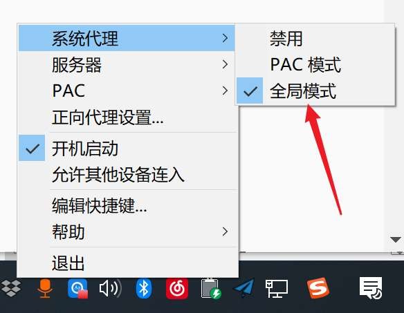
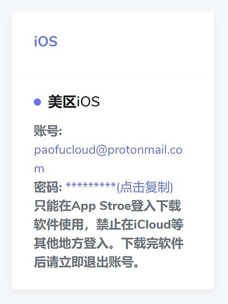

本系列教程一共三篇

1. [本篇教程](https://github.com/sun-shadow/Surf_the_Internet/blob/master/%E5%85%A5%E9%97%A8%E7%AF%87.md)
2. [如何用 Chrome 插件 FQ](https://github.com/sun-shadow/Surf_the_Internet/blob/master/%E6%8F%92%E4%BB%B6%E7%AF%87.md)
3. [命令行如何 FQ](https://github.com/sun-shadow/Surf_the_Internet/blob/master/%E5%91%BD%E4%BB%A4%E8%A1%8C%E7%AF%87.md)

这是第一篇

---

以下将「翻了个墙」简称为「FQ」
本文教你如何使用 Shadowsocks + Chrome 插件来 FQ。

1. 下载 Shadowsocks 客户端

    https://github.com/shadowsocks/shadowsocks-windows/releases 在页面里找到 Assets（找不到的请使用 Ctrl + F 找），点击 Assets，看到 Shadowsocks-x.x.x.zip 下载

    上面是 windows 链接，下面是 mac 的

    https://github.com/shadowsocks/ShadowsocksX-NG/releases 在页面里找 zip 下载

    如果下载不了，可以找老师要客户端。

    解压后随便找个不会被删除的目录解压（我劝你不要放在 C 盘的目录里），双击 exe 打开客户端。

    现在你有客户端，但是没有代理服务器。

    P.S. Windows 7 用户可能无法打开客户端软件，这个时候你只需要下载 .NET Framework 4.6.2 并安装就可以了，安装包在我的前端系统课课程简介里有，你也可以自行搜索。

2. 购买代理服务器
    1. 进入 https冒号//order点shadowsocks点nl/aff.php?aff=473  或者 https冒号//portal点shadowsocks点nl/aff.php?aff=473 请自行替换网址中的冒号和点
        1. 有同学反应无法注册，其实不用注册，你购买的时候会提示你注册的。
        2. 网站较慢，不要点击「checkout」点太快，等详情显示出来了再点击「checkout」
        3. 购买的时候会让你填各种信息，你只要保证邮箱是你的即可，其他信息可以瞎填。
        4. 请购买最便宜的套餐（20澳币，约100人民币），不用担心流量不够，因为随时可以购买流量补充包。
        5. 如果发现无法 FQ，可以在网站上提交工单问客服怎么处理，看能不能帮忙或者退款什么的
   
总之你需要有一个服务器地址才行。

买了服务器地址，才能配置客户端

1. 双击小飞机图标打开 Shadowsocks 软件
2. 在系统托盘找到小飞机
3. 如果你是自己购买的服务器，那么就方便很多了，可以[扫码配置](https://github.com/sun-shadow/Surf_the_Internet/blob/master/%E5%A6%82%E4%BD%95%E6%89%AB%E7%A0%81%E9%85%8D%E7%BD%AE.md)，点这个链接，进去学会怎么扫码配置。

4. 开启系统代理（Mac系统点击「全局模式」），你可以FQ了！上个 Google 压压惊。
    
    如果你看不到本教程中的图片，说明图片被墙了。你需要开起全局翻墙（或者将 raw.githubusercontent.com 加入翻墙白名单）才能观看图片

    

5. 关闭系统代理就相当于不 FQ，但是这个时候代理其实并没有关闭，它会一直监听 1080 端口。

进阶：[如何用 Chrome 插件 FQ](https://github.com/sun-shadow/Surf_the_Internet/blob/master/%E6%8F%92%E4%BB%B6%E7%AF%87.md)

请 ctrl + D 收藏本页面，如果 SS 首页被屏蔽了，我会更新备用链接。

___

更新：我购买了一个月的泡F旗舰版，拿到了 iOS 美区共享账号

paofucloud at protonmail.com
Paofu12345678

这个账号可以下载客户端app，让你的 iPhone 也 FQ
